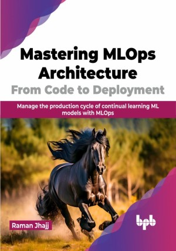

# Mastering MLOps Architecture: From Code to Deployment

Harness the power of MLOps for managing real time machine learning project cycle

This is the repository for [Mastering MLOps Architecture: From Code to Deployment
](https://bpbonline.com/products/mastering-mlops-architecture-from-code-to-deployment?variant=43065176162504),published by BPB Publications.

## About the Book
MLOps, a combination of DevOps, data engineering, and machine learning, is crucial for delivering high-quality machine learning results due to the dynamic nature of machine learning data. This book delves into MLOps, covering its core concepts, components, and architecture, demonstrating how MLOps fosters robust and continuously improving machine learning systems.

By covering the end-to-end machine learning pipeline from data to deployment, the book helps readers implement MLOps workflows. It discusses techniques like feature engineering, model development, A/B testing, and canary deployments. The book equips readers with knowledge of MLOps tools and infrastructure for tasks like model tracking, model governance, metadata management, and pipeline orchestration. Monitoring and maintenance processes to detect model degradation are covered in depth. Readers can gain skills to build efficient CI/CD pipelines, deploy models faster, and make their ML systems more reliable, robust and production-ready.

Overall, the book is an indispensable guide to MLOps and its applications for delivering business value through continuous machine learning and AI.

## What You Will Learn
• Architect robust MLOps infrastructure with components like feature stores.

• Learn to use PowerShell for administration, such as on the Cloud, Active Directory, VMware anLeverage MLOps tools like model registries, metadata stores, pipelines.

•  Build CI/CD workflows to deploy models faster and continually.

•  Monitor and maintain models in production to detect degradation.

•  Create automated workflows for retraining and updating models in production.
